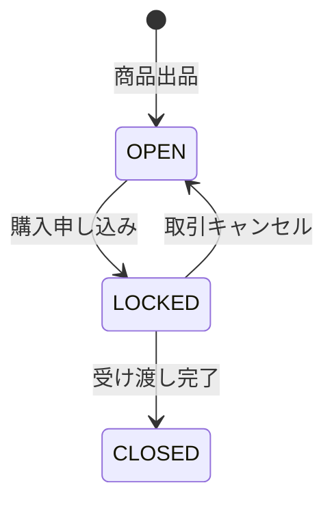
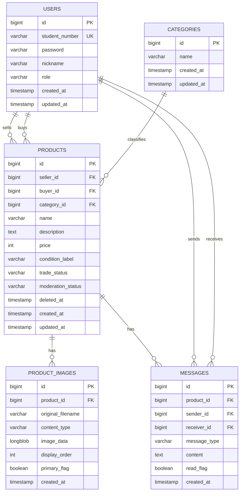

# CampusTrade 基本設計書

## 1. 目的

CampusTrade は、学内における教科書、参考書、生活用品などのリユースを促進し、学生同士の取引と受け渡し調整を支援する Web アプリケーションである。

本設計書は、`CampusTrade.md` の要件定義をもとに、Spring Boot で実装するための画面、機能、データ構造、権限制御、状態遷移を整理する。

## 2. システム概要

### 2.1 想定技術構成

| 区分 | 技術 |
|---|---|
| アプリケーション | Spring Boot |
| 画面テンプレート | Thymeleaf |
| 認証・認可 | Spring Security |
| データアクセス | Spring Data JPA |
| データベース | MySQL |
| ビルド | Gradle |
| Java | Java 21 |

### 2.2 利用者

| 利用者 | 説明 | 主な操作 |
|---|---|---|
| 一般学生 | 学内で商品を出品・購入するユーザー | 登録、ログイン、出品、検索、購入申し込み、メッセージ送信、マイページ確認 |
| 管理者 | 出品内容やカテゴリを管理するユーザー | 商品一覧確認、不適切商品の非表示、カテゴリ管理 |

## 3. 機能設計

### 3.1 ユーザー管理

| 機能 | 内容 |
|---|---|
| 会員登録 | 学生番号、パスワード、ニックネームを登録する。 |
| ログイン | 学生番号とパスワードで認証する。 |
| プロフィール編集 | ニックネームなどの表示情報を変更する。 |
| マイページ | 自分の購入者向けページ、出品者向けページ、取引中の商品への導線を確認する。 |

### 3.2 商品管理

| 機能 | 内容 |
|---|---|
| 商品出品 | 商品名、説明、価格、カテゴリ、状態、画像を登録する。画像データは DB に保存する。 |
| 商品編集 | 出品者本人が出品内容を修正する。 |
| 商品削除 | 出品者本人が出品中の商品を非表示にする。履歴保持のため物理削除はしない。 |
| 商品検索 | キーワード、カテゴリ、販売中条件で商品を絞り込む。 |
| 商品詳細 | 商品情報、商品画像、出品者ニックネーム、購入ボタン、商品コメントを表示する。取引メッセージは取引詳細ページに表示する。 |

### 3.3 取引管理

商品は以下の取引ステータスを持つ。

| ステータス | 意味 |
|---|---|
| `OPEN` | 出品中。購入申し込みを受け付ける。 |
| `LOCKED` | 交渉中または取引中。購入者が決まっている。 |
| `CLOSED` | 取引完了。手渡しが完了している。 |

状態遷移は以下とする。



購入申し込みが行われた時点で `Products.buyer_id` に購入者を設定し、商品ステータスを `LOCKED` に変更する。`LOCKED` 以降は、商品情報の編集と他ユーザーからの購入申し込みを不可にする。

取引キャンセルは `LOCKED` の間だけ可能とし、キャンセル時は `Products.buyer_id` を `NULL` に戻して `OPEN` に変更する。`CLOSED` の商品は履歴保持のため `OPEN` には戻さない。

### 3.4 メッセージ管理

メッセージは商品に紐づけて保存し、用途に応じて「商品コメント」と「取引メッセージ」に分ける。

| 種類 | 用途 | 表示場所 | 表示範囲 |
|---|---|---|---|
| 商品コメント | 購入前の質問や補足説明 | 商品詳細画面 | 商品詳細を閲覧できるユーザー全員 |
| 取引メッセージ | 購入後の受け渡し調整 | 購入者取引詳細、出品者取引詳細 | 出品者、購入者、管理者のみ |

取引メッセージは、購入者向けページと出品者向けページで表示場所を分ける。ただしデータは分けず、同じ商品取引に紐づく1つの非公開メッセージスレッドとして扱う。

| 項目 | 方針 |
|---|---|
| 紐づき | 1つの商品に複数メッセージを紐づける。 |
| 送信者 | ログイン中ユーザーを送信者として記録する。 |
| 受信者 | 商品コメントでは `NULL`、取引メッセージでは出品者または購入者を記録する。 |
| 表示範囲 | `message_type` により公開範囲を切り替える。取引メッセージは現在の出品者・購入者ペアの送受信だけを一般学生に表示する。 |
| 並び順 | 送信日時の昇順で表示する。 |

## 4. 画面設計

| 画面 | URL 例 | 認証 | 概要 |
|---|---|---|---|
| トップ画面 | `/` | 不要 | 新着商品と検索フォームを表示する。 |
| 商品検索結果画面 | `/products?keyword=...&categoryId=...` | 不要 | 検索条件に合致する販売中商品を表示する。 |
| 商品詳細画面 | `/products/{id}` | 不要 | 商品情報、購入ボタン、商品コメントを表示する。 |
| 商品画像表示 | `/products/{id}/images/{imageId}` | 不要 | DB に保存した画像データを返す。 |
| 商品出品画面 | `/products/new` | 必要 | 商品情報を入力して出品する。 |
| 商品編集画面 | `/products/{id}/edit` | 必要 | 出品者本人が商品情報を編集する。 |
| マイページ | `/mypage` | 必要 | 購入者ページ、出品者ページ、取引中商品への入口を表示する。 |
| 購入者ページ | `/mypage/purchases` | 必要 | 自分が購入者になっている取引を表示する。 |
| 購入者取引詳細 | `/mypage/purchases/{id}` | 購入者 | 購入者向けの取引状態、取引メッセージ、キャンセル・完了操作を表示する。 |
| 出品者ページ | `/mypage/sales` | 必要 | 自分が出品した商品と成立済み取引を表示する。 |
| 出品者取引詳細 | `/mypage/sales/{id}` | 出品者 | 出品者向けの取引状態、購入者情報、取引メッセージ、キャンセル・完了操作を表示する。 |
| ログイン画面 | `/login` | 不要 | 学生番号とパスワードでログインする。 |
| 会員登録画面 | `/register` | 不要 | 学生番号、パスワード、ニックネームを登録する。 |
| 管理者商品一覧 | `/admin/products` | 管理者 | ステータス別に商品を確認する。 |
| 管理者カテゴリ管理 | `/admin/categories` | 管理者 | カテゴリを追加・編集・削除する。 |

## 5. データ設計

### 5.1 ER 図



### 5.2 users

| カラム | 型 | 制約 | 説明 |
|---|---|---|---|
| id | BIGINT | PK | ユーザーID |
| student_number | VARCHAR(32) | NOT NULL, UNIQUE | 学生番号。ログインIDとして使う。 |
| password | VARCHAR(255) | NOT NULL | ハッシュ化済みパスワード |
| nickname | VARCHAR(50) | NOT NULL | 画面表示用の名前 |
| role | VARCHAR(20) | NOT NULL | `STUDENT` または `ADMIN` |
| created_at | TIMESTAMP | NOT NULL | 作成日時 |
| updated_at | TIMESTAMP | NOT NULL | 更新日時 |

### 5.3 products

| カラム | 型 | 制約 | 説明 |
|---|---|---|---|
| id | BIGINT | PK | 商品ID |
| seller_id | BIGINT | NOT NULL, FK | 出品者ID |
| buyer_id | BIGINT | NULL, FK | 購入者ID。購入者未確定時は NULL |
| category_id | BIGINT | NOT NULL, FK | カテゴリID |
| name | VARCHAR(100) | NOT NULL | 商品名 |
| description | TEXT | NOT NULL | 商品説明 |
| price | INT | NOT NULL | 価格。0円以上 |
| condition_label | VARCHAR(50) | NOT NULL | 商品状態 |
| trade_status | VARCHAR(20) | NOT NULL | `OPEN`, `LOCKED`, `CLOSED` |
| moderation_status | VARCHAR(20) | NOT NULL | `ACTIVE`, `PROHIBITED` |
| deleted_at | TIMESTAMP | NULL | 出品者による非表示日時 |
| created_at | TIMESTAMP | NOT NULL | 作成日時 |
| updated_at | TIMESTAMP | NOT NULL | 更新日時 |

`trade_status` は取引の状態、`moderation_status` は管理者による表示制御の状態として分ける。これにより、取引中の商品でも規約違反として非表示にできる。

通常の商品一覧では、`trade_status = OPEN`、`moderation_status = ACTIVE`、`deleted_at IS NULL` の商品を表示対象にする。

### 5.4 categories

| カラム | 型 | 制約 | 説明 |
|---|---|---|---|
| id | BIGINT | PK | カテゴリID |
| name | VARCHAR(50) | NOT NULL, UNIQUE | カテゴリ名 |
| created_at | TIMESTAMP | NOT NULL | 作成日時 |
| updated_at | TIMESTAMP | NOT NULL | 更新日時 |

初期カテゴリ例:

- 教科書
- 参考書
- 文房具
- 電化製品
- 生活用品
- その他

### 5.5 product_images

| カラム | 型 | 制約 | 説明 |
|---|---|---|---|
| id | BIGINT | PK | 商品画像ID |
| product_id | BIGINT | NOT NULL, FK | 対象商品ID |
| original_filename | VARCHAR(255) | NOT NULL | アップロード時のファイル名 |
| content_type | VARCHAR(100) | NOT NULL | `image/jpeg`, `image/png`, `image/webp` など |
| image_data | LONGBLOB | NOT NULL | 画像バイナリ |
| display_order | INT | NOT NULL | 表示順 |
| primary_flag | BOOLEAN | NOT NULL | 一覧で使う代表画像かどうか |
| created_at | TIMESTAMP | NOT NULL | 作成日時 |

商品画像は DB に保存する。1商品につき最大5枚まで登録でき、1枚あたりの上限は5MBとする。商品一覧では `primary_flag = true` の画像を表示し、商品詳細では `display_order` の昇順で表示する。

### 5.6 messages

| カラム | 型 | 制約 | 説明 |
|---|---|---|---|
| id | BIGINT | PK | メッセージID |
| product_id | BIGINT | NOT NULL, FK | 対象商品ID |
| sender_id | BIGINT | NOT NULL, FK | 送信者ID |
| receiver_id | BIGINT | NULL, FK | 受信者ID。商品コメントの場合は NULL |
| message_type | VARCHAR(20) | NOT NULL | `COMMENT` または `TRANSACTION` |
| content | TEXT | NOT NULL | メッセージ本文 |
| read_flag | BOOLEAN | NOT NULL | 既読フラグ |
| created_at | TIMESTAMP | NOT NULL | 送信日時 |

## 6. 権限制御

| 操作 | 未ログイン | 一般学生 | 管理者 |
|---|---|---|---|
| 商品一覧・検索 | 可 | 可 | 可 |
| 商品詳細閲覧 | 可 | 可 | 可 |
| 商品出品 | 不可 | 可 | 可 |
| 自分の商品編集 | 不可 | 可 | 可 |
| 他人の商品編集 | 不可 | 不可 | 管理目的のみ可 |
| 購入申し込み | 不可 | 可 | 可 |
| 商品コメント閲覧 | 可 | 可 | 可 |
| 商品コメント投稿 | 不可 | 可 | 可 |
| 取引メッセージ閲覧 | 不可 | 関係者のみ可 | 可 |
| 購入者取引詳細閲覧 | 不可 | 購入者本人のみ可 | 可 |
| 出品者取引詳細閲覧 | 不可 | 出品者本人のみ可 | 可 |
| 管理者商品一覧 | 不可 | 不可 | 可 |
| 商品の禁止表示 | 不可 | 不可 | 可 |

URL を直接入力した場合も、Controller または Service 層で本人確認と権限確認を行う。

## 7. 入力チェック

| 対象 | ルール |
|---|---|
| 学生番号 | 必須、重複不可 |
| パスワード | 必須、ハッシュ化して保存 |
| ニックネーム | 必須、50文字以内 |
| 商品名 | 必須、100文字以内 |
| 商品説明 | 必須 |
| 価格 | 必須、0円以上 |
| カテゴリ | 必須、存在するカテゴリのみ |
| 商品状態 | 必須 |
| 商品画像 | JPEG、PNG、WebP のみ。1商品5枚まで、1枚5MBまで |
| メッセージ本文 | 必須、空白のみ不可 |

## 8. 例外処理

| ケース | 対応 |
|---|---|
| 存在しない商品IDにアクセス | 404 ページを表示する。 |
| 権限のない編集・削除 | 403 ページを表示する。 |
| 未ログインで出品・購入 | ログイン画面へ遷移する。 |
| 購入済み商品に購入申し込み | エラーメッセージを表示し、商品詳細に戻す。 |
| 管理者により禁止された商品 | 一般画面では非表示、必要に応じて「禁止」と表示する。 |
| 画像サイズまたは形式が不正 | 入力画面に戻し、エラーメッセージを表示する。 |

## 9. 実装時のパッケージ構成案

```text
com.example.demo
├── CampusTradeApplication.java
├── controller
│   ├── AuthController.java
│   ├── ProductController.java
│   ├── MypageController.java
│   └── AdminController.java
├── entity
│   ├── User.java
│   ├── Product.java
│   ├── ProductImage.java
│   ├── Category.java
│   └── Message.java
├── repository
│   ├── UserRepository.java
│   ├── ProductRepository.java
│   ├── ProductImageRepository.java
│   ├── CategoryRepository.java
│   └── MessageRepository.java
├── service
│   ├── UserService.java
│   ├── ProductService.java
│   ├── ProductImageService.java
│   ├── TransactionService.java
│   └── MessageService.java
├── form
│   ├── RegisterForm.java
│   ├── ProductForm.java
│   └── MessageForm.java
└── security
    └── SecurityConfig.java
```

## 10. 実装優先度

1. ユーザー登録・ログイン
2. カテゴリ初期データ
3. 商品画像の DB 保存
4. 商品一覧・詳細
5. 商品出品・編集
6. 購入申し込みと `OPEN` から `LOCKED` への遷移
7. マイページ
8. 商品コメント
9. 取引メッセージ
10. 管理者商品一覧・禁止表示
11. 取引完了処理

## 11. 設計決定事項

| 項目 | 決定内容 |
|---|---|
| 商品画像 | `product_images` テーブルに DB 保存する。複数画像と代表画像に対応する。 |
| メッセージ公開範囲 | 購入前は公開の商品コメント、購入後は関係者だけの取引メッセージとして扱う。 |
| 取引メッセージの配置 | 商品詳細画面には表示せず、購入者取引詳細と出品者取引詳細に表示する。両画面は同じメッセージスレッドを参照する。 |
| 商品削除 | 物理削除は行わず、`deleted_at` による論理削除にする。取引履歴は残す。 |
| 取引キャンセル | `LOCKED` の間のみ可能。キャンセル時は `buyer_id` を `NULL` に戻し、`trade_status` を `OPEN` に戻す。 |
| 管理者アカウント | 初期データで管理者を1件作成する。以後の管理者追加は既存管理者がロールを変更する。 |
