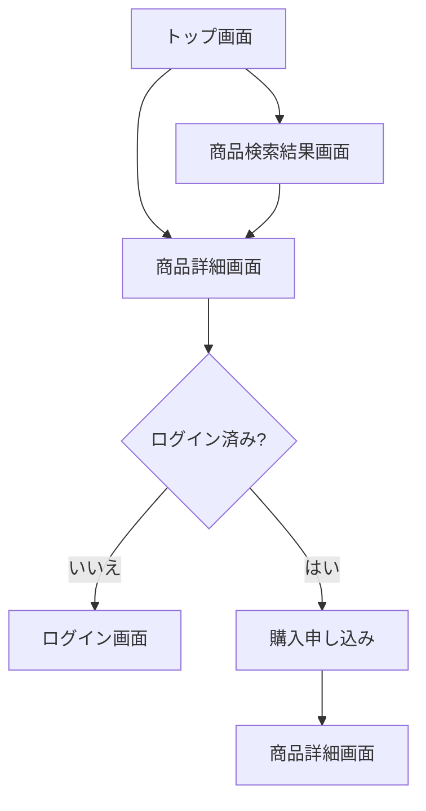
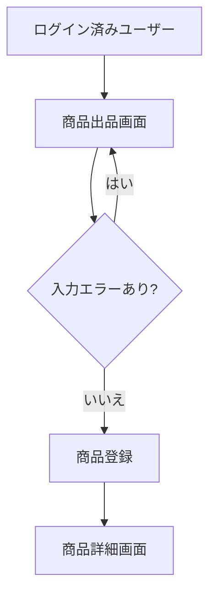
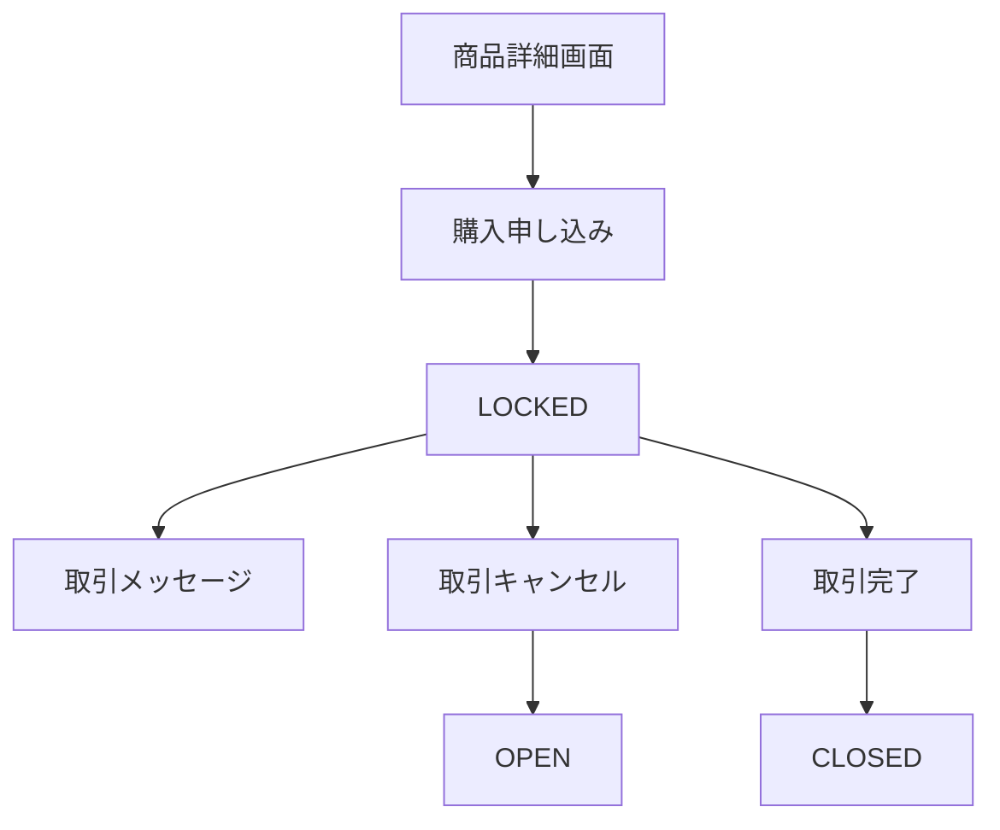
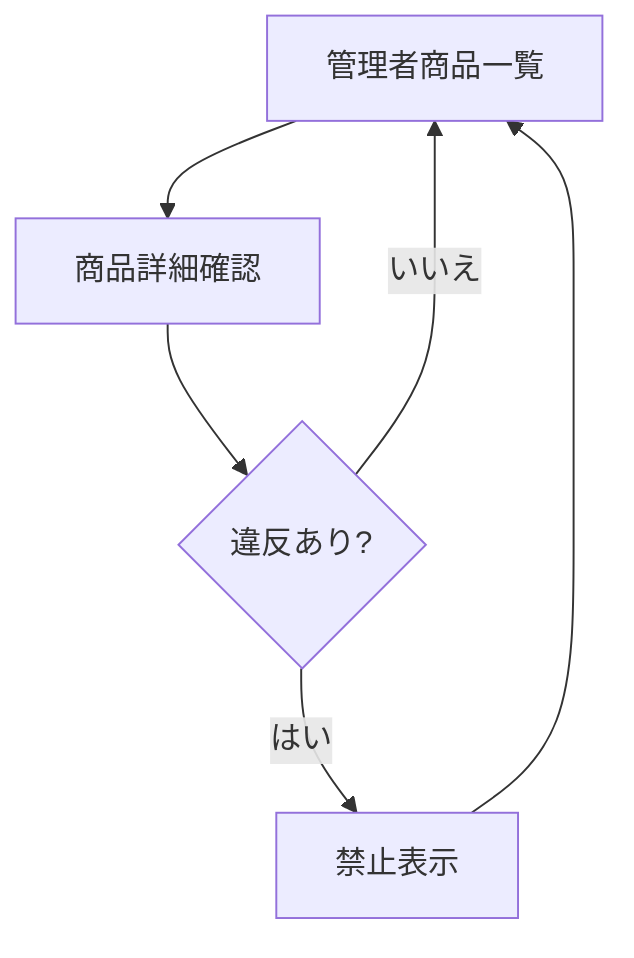

# CampusTrade 画面遷移・URL設計書

## 1. 目的

本書は CampusTrade の画面遷移、URL、HTTPメソッド、認証要否を定義する。ワイヤーフレームではなく、Controller 実装時に必要なルーティングと遷移条件を整理する。

## 2. 認証区分

| 表記 | 意味 |
|---|---|
| 不要 | 未ログインでもアクセスできる |
| 必要 | ログイン済みユーザーだけアクセスできる |
| 管理者 | 管理者権限のユーザーだけアクセスできる |
| 関係者 | 対象商品の出品者、購入者、管理者だけアクセスできる |

## 3. 画面一覧

| 画面ID | 画面名 | URL | 認証 |
|---|---|---|---|
| `TOP` | トップ画面 | `/` | 不要 |
| `PRODUCT_LIST` | 商品検索結果画面 | `/products` | 不要 |
| `PRODUCT_DETAIL` | 商品詳細画面 | `/products/{id}` | 不要 |
| `PRODUCT_IMAGE` | 商品画像表示 | `/products/{productId}/images/{imageId}` | 不要 |
| `PRODUCT_NEW` | 商品出品画面 | `/products/new` | 必要 |
| `PRODUCT_EDIT` | 商品編集画面 | `/products/{id}/edit` | 必要 |
| `MYPAGE` | マイページ | `/mypage` | 必要 |
| `LOGIN` | ログイン画面 | `/login` | 不要 |
| `REGISTER` | 会員登録画面 | `/register` | 不要 |
| `ADMIN_PRODUCTS` | 管理者商品一覧 | `/admin/products` | 管理者 |
| `ADMIN_CATEGORIES` | 管理者カテゴリ管理 | `/admin/categories` | 管理者 |

## 4. URL一覧

### 4.1 認証

| メソッド | URL | 認証 | 処理 | 正常時遷移 |
|---|---|---|---|---|
| GET | `/login` | 不要 | ログイン画面を表示 | `LOGIN` |
| POST | `/login` | 不要 | Spring Security によるログイン処理 | `/` |
| POST | `/logout` | 必要 | ログアウト処理 | `/login?logout` |
| GET | `/register` | 不要 | 会員登録画面を表示 | `REGISTER` |
| POST | `/register` | 不要 | 会員登録を実行 | `/login?registered` |

### 4.2 商品

| メソッド | URL | 認証 | 処理 | 正常時遷移 |
|---|---|---|---|---|
| GET | `/` | 不要 | 新着商品の一覧を表示 | `TOP` |
| GET | `/products` | 不要 | キーワード・カテゴリで検索 | `PRODUCT_LIST` |
| GET | `/products/{id}` | 不要 | 商品詳細を表示 | `PRODUCT_DETAIL` |
| GET | `/products/{productId}/images/{imageId}` | 不要 | DBから画像を返す | 画像レスポンス |
| GET | `/products/new` | 必要 | 商品出品画面を表示 | `PRODUCT_NEW` |
| POST | `/products` | 必要 | 商品と画像を登録 | `/products/{id}` |
| GET | `/products/{id}/edit` | 必要 | 商品編集画面を表示 | `PRODUCT_EDIT` |
| POST | `/products/{id}/edit` | 必要 | 商品情報を更新 | `/products/{id}` |
| POST | `/products/{id}/delete` | 必要 | 商品を論理削除 | `/mypage` |

### 4.3 取引

| メソッド | URL | 認証 | 処理 | 正常時遷移 |
|---|---|---|---|---|
| POST | `/products/{id}/purchase` | 必要 | 購入申し込み | `/products/{id}` |
| POST | `/products/{id}/cancel` | 関係者 | 取引キャンセル | `/products/{id}` |
| POST | `/products/{id}/close` | 関係者 | 取引完了 | `/products/{id}` |

### 4.4 メッセージ

| メソッド | URL | 認証 | 処理 | 正常時遷移 |
|---|---|---|---|---|
| POST | `/products/{id}/comments` | 必要 | 商品コメントを投稿 | `/products/{id}` |
| POST | `/products/{id}/messages` | 関係者 | 取引メッセージを投稿 | `/products/{id}` |

### 4.5 マイページ

| メソッド | URL | 認証 | 処理 | 正常時遷移 |
|---|---|---|---|---|
| GET | `/mypage` | 必要 | 出品履歴・購入履歴を表示 | `MYPAGE` |

### 4.6 管理者

| メソッド | URL | 認証 | 処理 | 正常時遷移 |
|---|---|---|---|---|
| GET | `/admin/products` | 管理者 | 管理者向け商品一覧を表示 | `ADMIN_PRODUCTS` |
| POST | `/admin/products/{id}/prohibit` | 管理者 | 商品を禁止表示にする | `/admin/products` |
| POST | `/admin/products/{id}/activate` | 管理者 | 禁止表示を解除する | `/admin/products` |
| GET | `/admin/categories` | 管理者 | カテゴリ一覧を表示 | `ADMIN_CATEGORIES` |
| POST | `/admin/categories` | 管理者 | カテゴリを追加 | `/admin/categories` |
| POST | `/admin/categories/{id}/edit` | 管理者 | カテゴリ名を更新 | `/admin/categories` |
| POST | `/admin/categories/{id}/delete` | 管理者 | カテゴリを削除 | `/admin/categories` |

## 5. 主要画面遷移

### 5.1 商品閲覧から購入まで

### 5.2 出品

### 5.3 取引

### 5.4 管理者確認

## 6. 画面別表示条件

### 6.1 商品一覧・検索結果

表示対象:

- `trade_status = OPEN`
- `moderation_status = ACTIVE`
- `deleted_at IS NULL`

表示項目:

- 代表画像
- 商品名
- 価格
- カテゴリ
- 商品状態
- 出品日時

検索条件:

- キーワード
- カテゴリID
- 販売中のみ

### 6.2 商品詳細

表示項目:

- 商品画像一覧
- 商品名
- 説明
- 価格
- カテゴリ
- 商品状態
- 出品者ニックネーム
- 取引ステータス
- 商品コメント

ボタン表示:

| 条件 | 表示する操作 |
|---|---|
| 未ログイン | ログインへの導線 |
| ログイン済み・他人の商品・`OPEN` | 購入申し込み |
| 出品者本人・`OPEN` | 編集、非表示 |
| 出品者本人または購入者・`LOCKED` | 取引メッセージ、キャンセル、取引完了 |
| `CLOSED` | 取引完了表示のみ |
| `PROHIBITED` | 一般画面では非表示 |

### 6.3 マイページ

表示項目:

- 自分の出品一覧
- 自分の購入一覧
- 取引中の商品
- 取引完了の商品

## 7. エラー時遷移

| ケース | 遷移 |
|---|---|
| 未ログインで認証必須URLにアクセス | `/login` |
| 権限のない商品編集 | 403ページ |
| 存在しない商品ID | 404ページ |
| 入力チェックエラー | 元の入力画面 |
| 購入できない商品への購入申し込み | 商品詳細画面にエラー表示 |
| 画像形式・サイズエラー | 商品出品または編集画面にエラー表示 |

## 8. Controller配置案

| Controller | 担当URL |
|---|---|
| `AuthController` | `/login`, `/register` |
| `ProductController` | `/`, `/products/**` |
| `ProductImageController` | `/products/{productId}/images/{imageId}` |
| `TransactionController` | `/products/{id}/purchase`, `/products/{id}/cancel`, `/products/{id}/close` |
| `MessageController` | `/products/{id}/comments`, `/products/{id}/messages` |
| `MypageController` | `/mypage` |
| `AdminController` | `/admin/**` |

